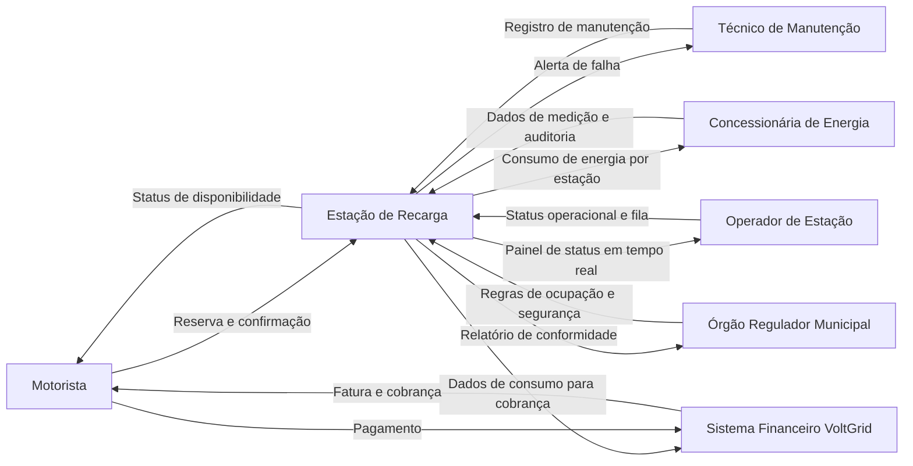

```mermaid
flowchart LR
    M["Motorista"]
    E["Estação de Recarga"]
    T["Técnico de Manutenção"]
    C["Concessionária de Energia"]
    F["Sistema Financeiro VoltGrid"]
    O["Operador de Estação"]
    R["Órgão Regulador Municipal"]

    M -- "Reserva e confirmação" --> E
    E -- "Status de disponibilidade" --> M
    E -- "Alerta de falha" --> T
    T -- "Registro de manutenção" --> E
    E -- "Consumo de energia por estação" --> C
    C -- "Dados de medição e auditoria" --> E
    E -- "Dados de consumo para cobrança" --> F
    F -- "Fatura e cobrança" --> M
    M -- "Pagamento" --> F
    O -- "Status operacional e fila" --> E
    E -- "Painel de status em tempo real" --> O
    E -- "Relatório de conformidade" --> R
    R -- "Regras de ocupação e segurança" --> E
```
