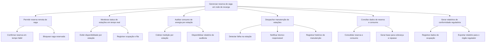

```mermaid
flowchart TD
    N1["Gerenciar reserva de vaga em rede de recarga"]

    N1 --> A["Permitir reserva remota de vaga"]
    N1 --> B["Monitorar status de estações em tempo real"]
    N1 --> C["Auditar consumo de energia por estação"]
    N1 --> D["Despachar manutenção de estações"]
    N1 --> E["Conciliar dados de reserva e consumo"]
    N1 --> F["Gerar relatórios de conformidade regulatória"]

    A --> A1["Confirmar reserva em tempo hábil"]
    A --> A2["Bloquear vaga reservada"]

    B --> B1["Exibir disponibilidade por estação"]
    B --> B2["Registrar ocupação e fila"]

    C --> C1["Coletar medição por estação"]
    C --> C2["Disponibilizar relatório de auditoria"]

    D --> D1["Detectar falha na estação"]
    D --> D2["Notificar técnico responsável"]
    D --> D3["Registrar histórico de manutenção"]

    E --> E1["Consolidar reserva e consumo"]
    E --> E2["Gerar base para cobrança e repasse"]

    F --> F1["Registrar dados de ocupação"]
    F --> F2["Exportar relatório para o órgão regulador"]
```
