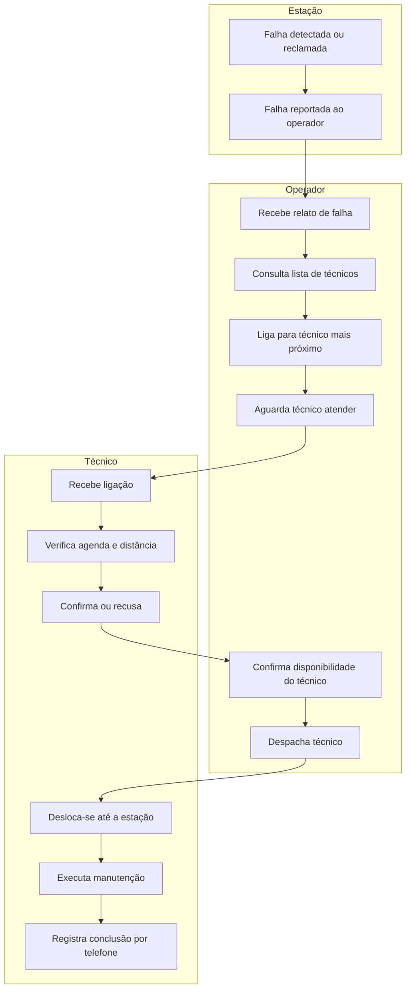

```mermaid
flowchart TD
    subgraph EST["Estação"]
        E1["Falha detectada ou reclamada"]
        E2["Falha reportada ao operador"]
    end

    subgraph OPE["Operador"]
        O1["Recebe relato de falha"]
        O2["Consulta lista de técnicos"]
        O3["Liga para técnico mais próximo"]
        O4["Aguarda técnico atender"]
        O5["Confirma disponibilidade do técnico"]
        O6["Despacha técnico"]
    end

    subgraph TEC["Técnico"]
        T1["Recebe ligação"]
        T2["Verifica agenda e distância"]
        T3["Confirma ou recusa"]
        T4["Desloca-se até a estação"]
        T5["Executa manutenção"]
        T6["Registra conclusão por telefone"]
    end

    E1 --> E2 --> O1 --> O2 --> O3 --> O4 --> T1 --> T2 --> T3 --> O5 --> O6 --> T4 --> T5 --> T6
```
