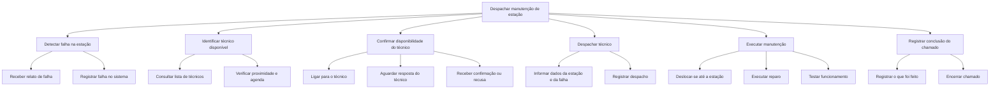

```mermaid
flowchart TD
    N1["Despachar manutenção de estação"]

    N1 --> A["Detectar falha na estação"]
    N1 --> B["Identificar técnico disponível"]
    N1 --> C["Confirmar disponibilidade do técnico"]
    N1 --> D["Despachar técnico"]
    N1 --> E["Executar manutenção"]
    N1 --> F["Registrar conclusão do chamado"]

    A --> A1["Receber relato de falha"]
    A --> A2["Registrar falha no sistema"]

    B --> B1["Consultar lista de técnicos"]
    B --> B2["Verificar proximidade e agenda"]

    C --> C1["Ligar para o técnico"]
    C --> C2["Aguardar resposta do técnico"]
    C --> C3["Receber confirmação ou recusa"]

    D --> D1["Informar dados da estação e da falha"]
    D --> D2["Registrar despacho"]

    E --> E1["Deslocar-se até a estação"]
    E --> E2["Executar reparo"]
    E --> E3["Testar funcionamento"]

    F --> F1["Registrar o que foi feito"]
    F --> F2["Encerrar chamado"]
```
