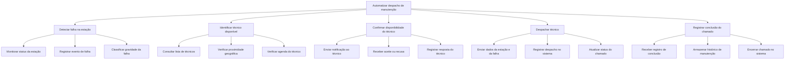

```mermaid
flowchart TD
    F0["Automatizar despacho de manutenção"]

    F0 --> F1["Detectar falha na estação"]
    F0 --> F2["Identificar técnico disponível"]
    F0 --> F3["Confirmar disponibilidade do técnico"]
    F0 --> F4["Despachar técnico"]
    F0 --> F5["Registrar conclusão do chamado"]

    F1 --> F1a["Monitorar status da estação"]
    F1 --> F1b["Registrar evento de falha"]
    F1 --> F1c["Classificar gravidade da falha"]

    F2 --> F2a["Consultar lista de técnicos"]
    F2 --> F2b["Verificar proximidade geográfica"]
    F2 --> F2c["Verificar agenda do técnico"]

    F3 --> F3a["Enviar notificação ao técnico"]
    F3 --> F3b["Receber aceite ou recusa"]
    F3 --> F3c["Registrar resposta do técnico"]

    F4 --> F4a["Enviar dados da estação e da falha"]
    F4 --> F4b["Registrar despacho no sistema"]
    F4 --> F4c["Atualizar status do chamado"]

    F5 --> F5a["Receber registro de conclusão"]
    F5 --> F5b["Armazenar histórico de manutenção"]
    F5 --> F5c["Encerrar chamado no sistema"]
```
