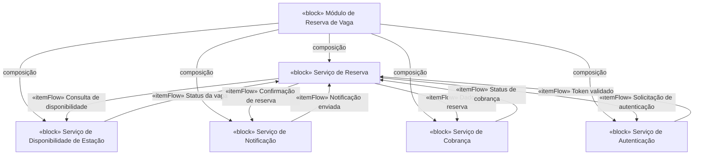

```mermaid
flowchart TD
    SIS["«block» Módulo de Reserva de Vaga"]

    SIS -->|composição| SR["«block» Serviço de Reserva"]
    SIS -->|composição| SD["«block» Serviço de Disponibilidade de Estação"]
    SIS -->|composição| SN["«block» Serviço de Notificação"]
    SIS -->|composição| SC["«block» Serviço de Cobrança"]
    SIS -->|composição| SA["«block» Serviço de Autenticação"]

    SR -->|"«itemFlow» Consulta de disponibilidade"| SD
    SD -->|"«itemFlow» Status da vaga"| SR
    SR -->|"«itemFlow» Confirmação de reserva"| SN
    SN -->|"«itemFlow» Notificação enviada"| SR
    SR -->|"«itemFlow» Dados da reserva"| SC
    SC -->|"«itemFlow» Status de cobrança"| SR
    SR -->|"«itemFlow» Solicitação de autenticação"| SA
    SA -->|"«itemFlow» Token validado"| SR
```
