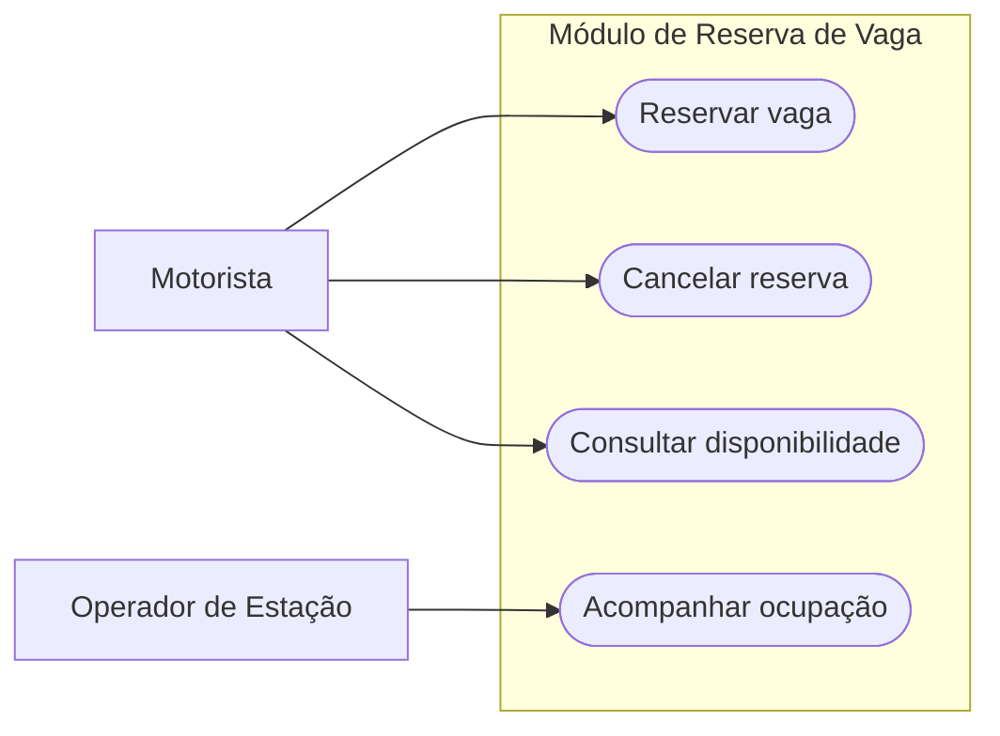

```mermaid
flowchart LR
    M["Motorista"]
    O["Operador de Estação"]

    subgraph SIS["Módulo de Reserva de Vaga"]
        UC1(["Reservar vaga"])
        UC2(["Cancelar reserva"])
        UC3(["Consultar disponibilidade"])
        UC4(["Acompanhar ocupação"])
    end

    M --> UC1
    M --> UC2
    M --> UC3
    O --> UC4
```
