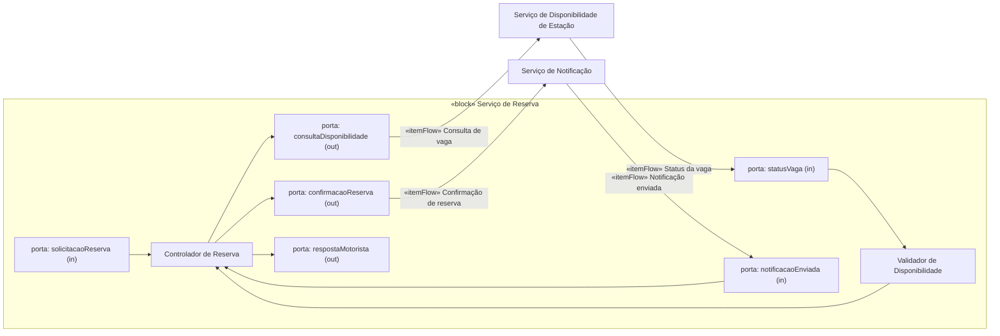

```mermaid
flowchart LR
    subgraph SR["«block» Serviço de Reserva"]
        direction LR

        P1["porta: solicitacaoReserva (in)"]
        P2["porta: consultaDisponibilidade (out)"]
        P3["porta: statusVaga (in)"]
        P4["porta: confirmacaoReserva (out)"]
        P5["porta: notificacaoEnviada (in)"]
        P6["porta: respostaMotorista (out)"]

        CTRL["Controlador de Reserva"]
        VAL["Validador de Disponibilidade"]

        P1 --> CTRL
        CTRL --> P2
        P3 --> VAL
        VAL --> CTRL
        CTRL --> P4
        P5 --> CTRL
        CTRL --> P6
    end

    SD["Serviço de Disponibilidade de Estação"]
    SN["Serviço de Notificação"]

    P2 -- "«itemFlow» Consulta de vaga" --> SD
    SD -- "«itemFlow» Status da vaga" --> P3
    P4 -- "«itemFlow» Confirmação de reserva" --> SN
    SN -- "«itemFlow» Notificação enviada" --> P5
```
