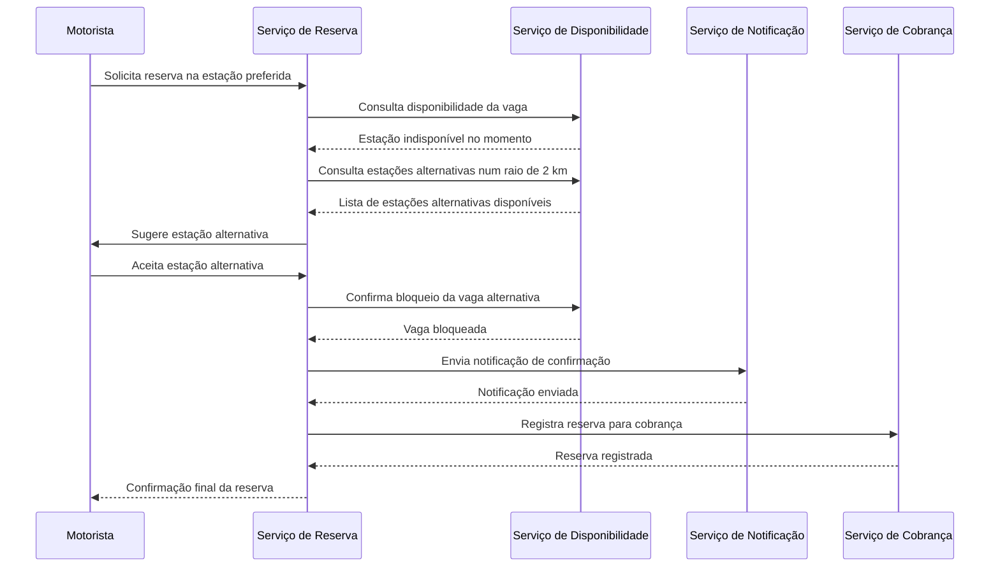

```mermaid
sequenceDiagram
    participant M as Motorista
    participant SR as Serviço de Reserva
    participant SD as Serviço de Disponibilidade
    participant SN as Serviço de Notificação
    participant SC as Serviço de Cobrança

    M->>SR: Solicita reserva na estação preferida
    SR->>SD: Consulta disponibilidade da vaga
    SD-->>SR: Estação indisponível no momento
    SR->>SD: Consulta estações alternativas num raio de 2 km
    SD-->>SR: Lista de estações alternativas disponíveis
    SR->>M: Sugere estação alternativa
    M->>SR: Aceita estação alternativa
    SR->>SD: Confirma bloqueio da vaga alternativa
    SD-->>SR: Vaga bloqueada
    SR->>SN: Envia notificação de confirmação
    SN-->>SR: Notificação enviada
    SR->>SC: Registra reserva para cobrança
    SC-->>SR: Reserva registrada
    SR-->>M: Confirmação final da reserva
```
